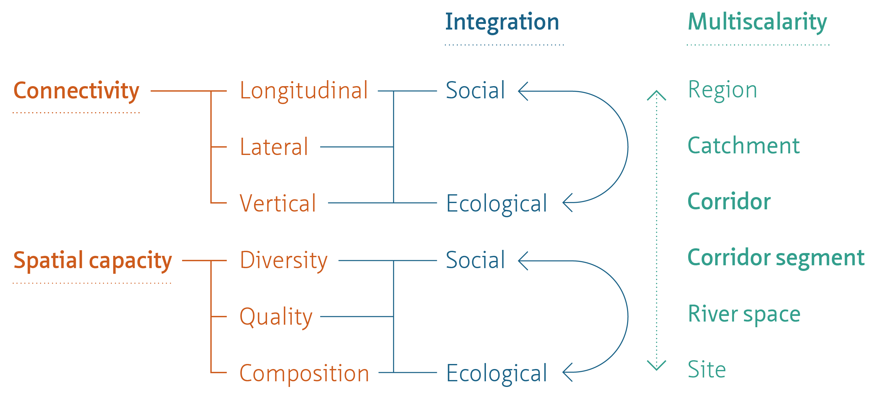
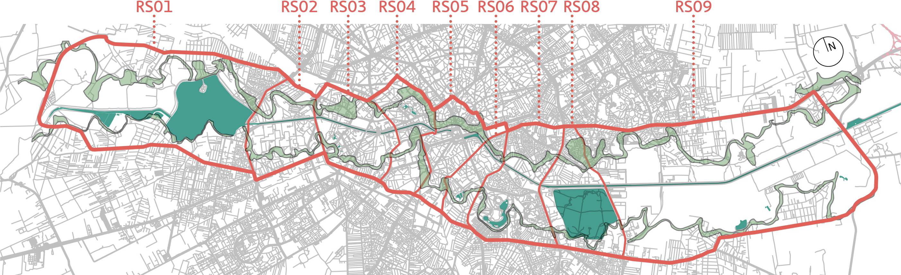

# Social-Ecological Integrated Urban River Corridor Assessment Framework

This repository contains the GIS application files used in the social-ecological integration assessment of the river Dâmbovița, Bucharest, as part of the PhD research "Integrated Urban River Corridors: Spatial Design for Social-Ecological Resilience in Bucharest and Beyond" ([Forgaci, 2018](https://doi.org/10.7480/abe.2018.31)), conducted at TU Delft under the supervision of Prof. Arjan van Timmeren, Prof. Machiel van Dorst, and [Dr. Jorge Gil](https://github.com/jorgegil).

The assessment framework consists of (1) an indicator system and (2) a method of social-ecological integration assessment.

### Indicator system

Informed by an overview of current approaches to urban river assessment in urban planning and design, landscape architecture and landscape ecology, and structured by the four properties of URCs identified in Forgaci ([2018](https://doi.org/10.7480/abe.2018.31))—namely, Connectivity, Spatial capacity, Integration, and Multiscalarity—, the assessment framework comprises a system of social and ecological indicators of connectivity (with the sub-categories of lateral, longitudinal, and vertical connectivity) and spatial capacity (with the sub-categories of diversity, quality, and composition).

### Method of assessment

The method of mirrored assessment confronts social and ecological indicators of corresponding sub-categories (e.g. ecological spatial diversity and social spatial diversity) on corridor segment scale and on the scale of the URC. As a planning or design decision tool, this method of assessment highlights key areas of intervention where a minimum desirable goal of social-ecological integration can be achieved.

### Delineation

The assessment framework and its application are described in depth in [Chapters 5 and 6](https://journals.open.tudelft.nl/plugins/generic/pdfJsViewer/pdf.js/web/viewer.html?file=https%3A%2F%2Fjournals.open.tudelft.nl%2Fabe%2Farticle%2Fdownload%2F3275%2F3447%2F8841#9789463661096-TXT.indd%3A.322290%3A59394) of Forgaci (2018), respectively. [Appendix E](https://journals.open.tudelft.nl/plugins/generic/pdfJsViewer/pdf.js/web/viewer.html?file=https%3A%2F%2Fjournals.open.tudelft.nl%2Fabe%2Farticle%2Fdownload%2F3275%2F3447%2F8841#9789463661096-TXT.indd%3A.322609%3A59470), gives a detailed description of the workflows and software used in the application of each indicator.

The data resulting from the assessment of URC Dâmbovița, Bucharest, can be found at <https://doi.org/10.4121/15126795.v1>.

The dataset was generated between 2017-xx-xx and 2017-xx-xx by Claudiu Forgaci and Daniele Cannatella, and it was last reviewed on 2021-09-20 by Claudiu Forgaci.