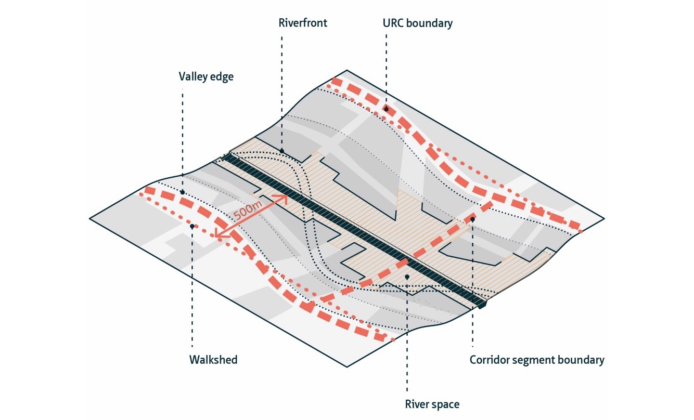

# Social-Ecologically Integrated Urban River Corridors - Assessment Framework

This repository contains the GIS application files used in the social-ecological integration assessment of the river Dâmbovița, Bucharest, as part of the PhD research "Integrated Urban River Corridors: Spatial Design for Social-Ecological Resilience in Bucharest and Beyond" ([Forgaci, 2018](https://doi.org/10.7480/abe.2018.31)), conducted at TU Delft under the supervision of Prof. Arjan van Timmeren, Prof. Machiel van Dorst, and [Dr. Jorge Gil](https://github.com/jorgegil), and in collaboration with Dr. Daniele Cannatella.

The assessment framework consists of [an indicator system](#Indicator-system) and a [method of social-ecological integration assessment](#Method-of-social-ecological-integration-assessment), an it is carried out on [Corridor Segments (CS) as spatial-analytical units of the Urban River Corridor (URC)](#Spatial-delineation) in question.

### Spatial delineation

As depicted in the figure below, the delineation of an URC, that is, its **outer boundary**, its **corridor segments** and **the river space**, is carried out as follows:

1.  The edges of the river valley are determined, for instance, from a digital elevation model.
2.  The main roads that are parallel, adjacent to, and outside the river valley are identified as the **outer boundary** of the URC. The ends of the corridor are determined by municipal or metropolitan administrative boundaries in such a way that continuity with the surrounding (non-urbanized) landscape is ensured.
3.  The outer boundary is adjusted with a walkshed (i.e. the area accessible within a walking distance) of 500m calculated from both edges of the river.
4.  After the outer boundary of the URC is delineated, **corridor segments** (CSs) are determined by dividing the URC along major transversal traffic lines. This way, spatially continuous units (i.e. uninterrupted by traffic barriers) are identified along the URC. The assumption made in this step is that urban areas between two major crossings have distinct morphological characteristics.
5.  The **river space** is defined as the open space surrounding the river and delineated by the first line of buildings.

To account for local characteristics, this method of delineation requires a qualitative judgement of the morphological particularities of the site in question. This is especially the case for corridor segment delineation, where variations in distance between major crossings may lead to an unbalanced subdivision of the corridor. If two consecutive major crossing are too close to each other (the case of narrow rivers with many crossings), adjacent segments with similar morphological characteristics can be merged. If consecutive crossings are too far from each other (the case of wide rivers), then the URC can be further subdivided based on changes in morphological characteristics of the oversized corridor segment.

### Indicator system

Informed by an overview of current approaches to urban river assessment in urban planning and design, landscape architecture and landscape ecology, and structured by the four properties of URCs identified in Forgaci ([2018](https://doi.org/10.7480/abe.2018.31))—namely, Connectivity, Spatial capacity, Integration, and Multiscalarity—, the assessment framework comprises a system of social and ecological indicators of connectivity (with the sub-categories of lateral, longitudinal, and vertical connectivity) and spatial capacity (with the sub-categories of diversity, quality, and composition).

### Method of social-ecological integration assessment

The method of mirrored assessment confronts social and ecological indicators of corresponding sub-categories (e.g. ecological spatial diversity and social spatial diversity) on corridor segment scale and on the scale of the URC. As a planning or design decision tool, this method of assessment highlights key areas of intervention where a minimum desirable goal of social-ecological integration can be achieved.

### Results

#### Folder structure

-   `URC-D-base` contains the geospatial base layers used for the analysis of URC Dâmbovița

-   `URC-D-analyses` contains MXD files with analyses carried out in ESRI ArcMap v10.\#. For each indicator selected for assessment, the analyitical workflows were saved with ArcMap's ModelBuilder.

-   `URC-D-results` contains the results

The dataset was generated between 2017-xx-xx and 2017-xx-xx by Claudiu Forgaci and Daniele Cannatella, and it was last reviewed on 2021-09-20 by Claudiu Forgaci. The data resulting from the assessment of URC Dâmbovița, Bucharest, can be found at <https://doi.org/10.4121/15126795.v1>.

The assessment framework and its application are described in depth in [Chapters 5 and 6](https://journals.open.tudelft.nl/plugins/generic/pdfJsViewer/pdf.js/web/viewer.html?file=https%3A%2F%2Fjournals.open.tudelft.nl%2Fabe%2Farticle%2Fdownload%2F3275%2F3447%2F8841#9789463661096-TXT.indd%3A.322290%3A59394) of Forgaci (2018), respectively. [Appendix E](https://journals.open.tudelft.nl/plugins/generic/pdfJsViewer/pdf.js/web/viewer.html?file=https%3A%2F%2Fjournals.open.tudelft.nl%2Fabe%2Farticle%2Fdownload%2F3275%2F3447%2F8841#9789463661096-TXT.indd%3A.322609%3A59470), gives a detailed description of the workflows and software used in the application of each indicator.
